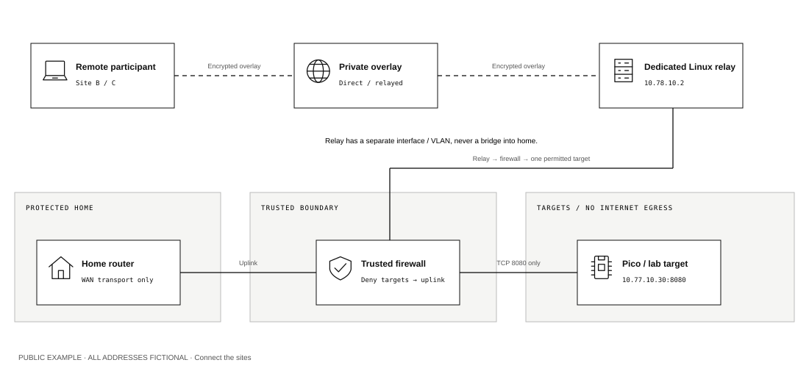

# Lab / Field Manual

A visual, practical guide to building isolated learning networks across three independent sites. The same pattern works for fewer or more sites.

**Start with an offline bench. Add a maintained, independent firewall before remote attack exercises. Use a separate services zone for games.** A consumer “DMZ host” setting and two routers in series do not establish that separation.



## Open the visual manual

Requirements: Python 3.10 or newer and a modern desktop browser. No package installation, external fonts, hosted services or internet connection is needed to read the manual.

From this directory:

```sh
python3 tools/serve.py
```

Open **http://127.0.0.1:8765**. Stop with Ctrl+C. The server listens only on the local computer. Do not serve a parent directory with a generic file server.

The custom monochrome application includes:

- Seven selectable architectures, three site presets, labelled vector diagrams and packet walkthroughs.
- Editable labels and IPv4 /24 planning addresses, with overlap and input checks.
- A firewall software selector for pfSense, OPNsense and OpenWrt, with platform-appropriate instructions.
- Original SVG figures that export exclusively from fictional defaults, including the edge-firewall and conditional split-ISP layouts.
- A complete handbook, device exercises, game instructions and sources.
- **Print / PDF**, which prepares all chapters and all seven architecture figures. A local edition adds its private inventory and guide.

For a browser-only public link, follow [Publish on GitHub](docs/PUBLISHING.md). The included GitHub Actions workflow builds and deploys a static Pages site after Pages is enabled in repository settings. Readers need no Python installation. The local server remains available for offline and private use.

## Reading and implementation order

1. [Start here](docs/START-HERE.md) and [networking foundations](docs/01-foundations.md).
2. [Compare the architectures](network/ARCHITECTURES.md) and [pfSense, OPNsense and OpenWrt](docs/PLATFORMS.md). Router count alone is not a security property.
3. [Build the offline bench](docs/03-build.md). The current microcontroller exercises require no Linux Raspberry Pi.
4. [Run the Uno, Pico W and Linux lessons](firmware/README.md).
5. [Inspect router firmware offline](docs/FIRMWARE-ANALYSIS.md).
6. Prepare a dedicated [OpenWrt firewall](network/OPENWRT.md) or follow the [pfSense / OPNsense implementation](network/PFSENSE-OPNSENSE.md), then [verify isolation](network/VALIDATION.md).
7. [Enroll participants and restrict remote access](network/REMOTE-ACCESS.md); [WireGuard](network/wireguard/README.md) is an alternative.
8. [Host Minecraft or Factorio](games/README.md) in a separately configured services zone.
9. [Operate and recover](docs/06-operations.md); complete the [private worksheets](docs/07-worksheets.md).

The strict firewall generator creates uplink, management, relay and target-zone rules for already configured interfaces. It does not automatically configure a household router, create a games zone, flash firmware or deploy a VPN.

## Code map

| Component | Entry point | Starts with |
|---|---|---|
| Uno / Uno R3 serial terminal | `firmware/uno_serial/uno_serial.ino` | USB and onboard LED; no network |
| Pico W MicroPython service | `firmware/pico_w/main.py` | Network disabled in example configuration |
| Linux access-control lesson | `firmware/linux_target/server.py` | Loopback; explicit lesson mode |
| Public firmware image inspection | `tools/inspect_firmware.py` | Local file only; no extraction or execution |
| pfSense / OPNsense implementation | `network/PFSENSE-OPNSENSE.md` | Manual interface/rule worksheet; no generated import |
| Dedicated OpenWrt candidate | `network/generate_firewall.py` | Draft output; no application |
| Tailscale roles and policy tests | `network/tailscale.policy.json` | Explicit role/service grants |
| Restricted SSH relay | `network/sshd-relay.conf.example` | Forward-only participant accounts |
| Minecraft / Factorio launcher | `games/launch.py` | Refuses incomplete private configuration |
| Private code instance builder | `tools/materialize.py` | Creates files outside the public tree |

Public examples use invented private subnets, reserved example names and documentation addresses. An actual overlay address is assigned by the VPN service and exchanged privately. Neither code generation nor successful unit tests prove physical network isolation.

## Create a private instance

The public source remains reusable. Local configuration belongs in a sibling directory outside this repository:

```sh
mkdir -m 700 ../private
cp tools/private-config.example.json ../private/config.local.json
chmod 600 ../private/config.local.json
python3 tools/materialize.py --private-dir ../private
```

This creates `../private/build/`, containing a private code copy, freshly generated lesson tokens and disabled Pico network configuration. With unconfirmed addresses, the firewall is deliberately not generated. The builder refuses to overwrite an existing build.

The workbench’s **Download code inputs** button also produces this exact input schema after **Update diagram** saves a valid plan. It preserves custom Pico/Linux target addresses, `firewall_platform` and `architecture`, while leaving network enablement and confirmation flags false. Only the dedicated `openwrt` + `tunnel` combination can produce a firewall candidate after both confirmations. pfSense, OPNsense, edge/split and other layouts produce an explanatory note and the inert lesson code. Older builder inputs without these two optional fields retain the original OpenWrt/tunnel defaults. The home-transit and services subnets are planning fields in the separate private-plan worksheet; they do not configure those zones. Store that download as `config.local.json` outside this repository. The private plan download is a separate worksheet, not the builder input.

Edit actual subnets and the installation country privately. Set confirmation flags only after the corresponding network checks. Wi-Fi enablement also needs the isolated lab SSID and password. For a later build, preserve or rename the existing build first. Game worlds and filled launcher configurations belong in a private runtime directory **outside the generated build**; this also satisfies the copied launcher's public-source-directory guard.

Display inventory is optional and separate from runtime credentials. A local `profile.json` contains only `labels`, `inventory` and `address_note`; the loopback server loads it only with explicit `--private-dir`. Runtime `config.local.json`, tokens and firmware settings are never served. The included repository has no identified home inventory.

## Check and export

The release manifest lists the reviewed source filenames and their SHA-256 hashes. The exporter rejects changed, missing, extra, secret-pattern and symlink files. The server serves only manifest-listed public filenames.

```sh
python3 tools/release.py check
python3 tools/release.py export --output /tmp/lab-public.zip
```

Extract that archive into a separate directory for GitHub. Do not upload a workspace containing private source images. No tool here uploads content or sends invitations.

After intentional public edits, review every changed file, including comments, examples, screenshots and metadata. Only then rebuild the manifest:

```sh
python3 tools/release.py manifest --reviewed-public-content
python3 tools/release.py check
```

Hashes detect drift from the review; they do not understand whether an arbitrary future sentence contains private information. The exported package has no original photos, personal hardware inventory, private build, runtime credentials, captures, logs or Git history. Public SVG export resets to examples; a downloaded **private plan** deliberately preserves its local input and must stay private.

## Verify locally

```sh
python3 -m unittest discover -s firmware/tests -p 'test_*.py' -v
python3 -m unittest discover -s games/tests -p 'test_*.py' -v
python3 -m unittest discover -s network -p 'test_*.py' -v
python3 -m unittest discover -s tests -p 'test_*.py' -v
node tests/model.test.mjs
```

Node is needed only for the optional JavaScript tests, not to run the manual. The Uno parser has a native C++ test documented in the firmware guide. [Validation record](VALIDATION.md) distinguishes host tests from unperformed hardware checks.

## Core distinctions

- **Pico W versus Linux Raspberry Pi:** a Wi-Fi microcontroller runs firmware; a full computer runs an operating system. Only the latter can host a Linux relay or suitable game server.
- **Isolation versus tunnelling:** a firewall contains a compromised target; a tunnel protects transport and grants remote reachability.
- **A trusted firewall versus an experimental router:** the component enforcing containment stays maintained and outside the attack scope.
- **A real DMZ versus a consumer DMZ host:** a real DMZ is a separated network; the consumer setting commonly forwards incoming traffic broadly to one host.
- **An ISP switch versus extra public addresses:** the split-ISP design requires provider support for both WAN connections; a switch creates neither leases nor firewall protection.
- **Docker versus a separate computer:** Linux containers share their host kernel. Keep the entire target host behind the trusted firewall and keep trusted roles off that host.
- **An available appliance versus supported hardware:** exact board revision, CPU, storage and current firmware support must be verified before installing an image.

Primary references are linked beside relevant claims throughout the handbook and collected in [Sources](docs/SOURCES.md). No specific unknown appliance is assumed compatible.

