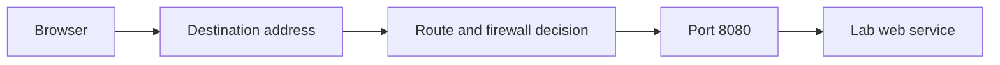

# Network foundations

## Begin with one message

A browser requesting a lab page needs three things: the address of a device, a service listening on that device, and a permitted path between them. A useful first example is `http://10.77.10.20:8080/`: `10.77.10.20` names the destination, `8080` names the service's listening port, and `http` names the application protocol.

A **packet** is a small unit of network data. A large transfer uses many packets. Packet headers describe where the packet came from and where it is going. An application protocol gives meaning to the contents.

## Addresses inside a site

A **LAN**, or local area network, connects nearby devices. Ethernet uses a cable; Wi-Fi uses radio. Neither word states whether the connected devices are trusted.

An **IP address** identifies a network interface for IP communication. A **subnet** is an address group treated as one local network. In the example `10.77.10.0/24`, the `/24` describes the network portion. Ordinary device addresses are `10.77.10.1` through `10.77.10.254`; `.0` describes the network and `.255` is its IPv4 broadcast address.

The **default gateway** is the router used for destinations outside that subnet. `10.77.10.1` is the gateway by convention in this handbook, not because every router must use `.1`. Devices in one subnet usually talk directly through a switch or access point. Those packets might never pass through the router's firewall.

**DHCP** automatically leases addresses and supplies settings such as the gateway and DNS server. A reservation makes the DHCP server consistently offer the same address to one device. A manually configured **static address** must be outside the dynamic pool, or explicitly excluded from it, to avoid collisions.

**DNS** translates a name to an address. Successful DNS resolution does not prove that the named service is reachable. The address `10.77.10.20` and a local name for the same machine are two ways to identify a destination; the firewall still decides whether the connection is allowed.

A **MAC address** identifies an interface on a local link. It is different from an IP address and is not a password. Ordinary routing does not carry the original Ethernet MAC address across every site. MAC addresses, Wi-Fi network names and serial numbers still belong outside the public inventory because they can identify equipment.

## What the boxes do

| Part | Plain meaning | Consequence for this lab |
|---|---|---|
| Switch | Connects devices on a local Ethernet network | An ordinary switch does not isolate its ports |
| Access point | Joins wireless devices to a network | A new Wi-Fi name alone does not create a security boundary |
| Router | Moves packets between networks | Different subnets need a route to communicate |
| Firewall | Applies rules to traffic | A route can exist while the firewall still denies access |
| Gateway | The next system along a path | The default gateway and VPN gateway can be different systems |
| Host | A computer or device using the network | A Linux server and a Wi-Fi microcontroller are both hosts |

A consumer “router” usually combines a router, switch, access point, DHCP server and firewall. Its menu labels do not guarantee independent network zones.

## Connections and ports

**TCP** gives applications an ordered stream and retransmits missing data. **UDP** sends individual datagrams without that built-in stream mechanism; applications can implement their own recovery. Both use port numbers. TCP port `25565` and UDP port `25565` are distinct endpoints.

A **listening address**, also called a bind address, limits which local address a service accepts traffic on. `127.0.0.1` means this computer only. `0.0.0.0` means every IPv4 interface, which is usually broader than intended for this lab. IPv6 has separate addresses and listeners; `[::]` can be broad too. Restricting a listener is useful, but a compromised system can start a different listener. The external firewall remains necessary.

## Crossing networks

**NAT**, network address translation, rewrites addresses, commonly so several local devices share one public IPv4 address. A typical stateful firewall permits replies to connections started from inside. That behavior is why a second home router often lets a lab initiate connections into the upstream home network. Address rewriting is not a promise of isolation.

**Port forwarding** maps an inbound destination port to a service behind a router. A public forward creates public reachability. The design here uses private remote access first, so experiment services need no public port forwards.

**CGNAT** means the internet provider also shares an upstream IPv4 address between customers. Changing a home router cannot create a port forward through the provider's NAT. An overlay connection can often establish outbound connectivity or relay traffic instead.

A **VPN tunnel** encrypts traffic between endpoints. An **overlay** gives participating devices an additional logical network over existing internet connections. Encryption protects traffic in transit; an access rule decides who can reach a service. Neither prevents a compromised target from using its ordinary Ethernet or Wi-Fi connection to reach nearby devices.

## Separation and privilege

A **zone** is a set of interfaces with a shared firewall policy. A **VLAN** separates Ethernet traffic logically on supporting switches and access points. An **access port** carries one untagged network to an ordinary device. A **trunk port** carries multiple tagged VLANs between equipment that understands them. An incorrectly configured trunk can expose multiple networks to a lab device. Assigning interfaces to firewall zones provides a place to enforce traffic decisions. [OpenWrt network and firewall model](https://openwrt.org/docs/guide-user/firewall/fw3_network)

An **allowlist** states what is permitted; all other access remains denied. **Least privilege** means granting only the required destination, port, identity and duration. **Management** means administration of the systems enforcing these rules. A learning participant needing one lab web page does not need access to the firewall dashboard.

**IPv4 and IPv6** are separate addressing systems that can coexist. IPv4 restrictions alone leave an incomplete boundary when IPv6 routes remain available. A design must deliberately filter both, or disable IPv6 on the isolated lab links and confirm that no alternate IPv6 route remains. IPv6 link-local communication can still occur within a shared link, so correct physical/VLAN separation remains essential.
