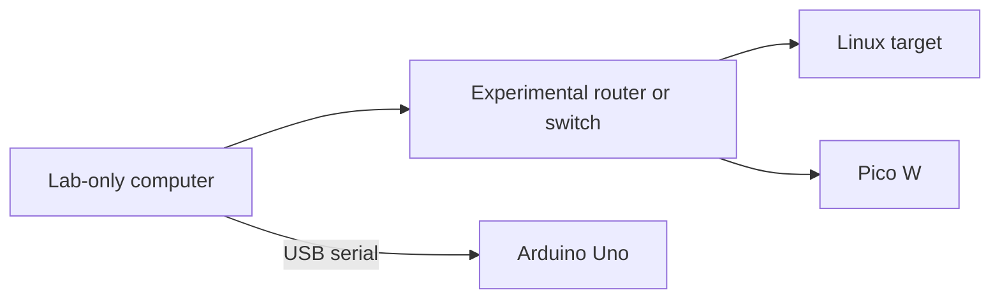
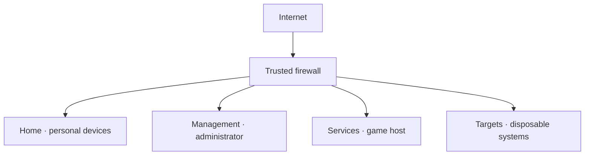
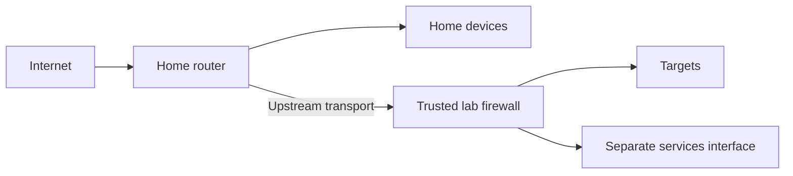
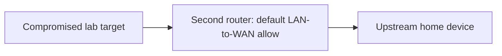

# Architecture choices

The number of routers is less important than where the trusted boundary sits. This design assumes that the target can eventually gain full control of its own operating system or experimental router. Home devices, firewall management and game saves remain outside that scope.

## Compare the options

| Scenario | Required capability | Good fit | Main limitation |
|---|---|---|---|
| Offline island | Lab-only switch/router and lab computer; no uplink | First exercises, router exploitation | No remote participants or internet |
| One trusted firewall with separate zones | Independent physical interfaces or correctly configured VLANs; IPv4/IPv6 policy | Long-term home, targets and services separation | Misconfiguration of the shared firewall affects all zones |
| Existing home router plus dedicated trusted lab firewall | Lab firewall with enforced target-to-upstream restrictions; independent target equipment | Retaining an existing home router | The home is on the upstream side and must be explicitly protected |
| Verified isolated guest network as uplink | Guest network blocking main LAN and management on both IP families; suitable wired or Wi-Fi attachment | Low equipment count after capability testing | Many guest features isolate wireless clients only or still permit router management |
| Ordinary second NAT router | Default consumer router configuration | Routing demonstrations | Does not provide the required target-to-home boundary |
| Public port forward into a real services DMZ | Real separated subnet and reviewed ingress/egress policy | Later public game hosting | Public attack surface and operational responsibilities increase |

A VPN is added to one of the isolated designs. It is not a competing replacement for a firewall or VLAN.

## A · Offline island

The experimental router's WAN port remains unplugged. A lab computer has home Wi-Fi, tethering, internet sharing, bridging and other network interfaces disabled. The router has no wireless repeater, mesh or client uplink. USB connection to a trusted personal computer also crosses a boundary: use a disposable lab computer when experimenting with hostile firmware or USB behavior.

This is the starting architecture while router capabilities are unknown. Wi-Fi radio can still reach beyond a room; a detached WAN cable does not contain radio interference. Exercises use the lab's own access point and clients, low-impact traffic and a distinct lab SSID. Wired exercises make the boundaries easier to inspect.

## B · One trusted firewall, several zones

The firewall has a separate interface or VLAN for each zone. Home-to-target access is not automatically broad: only the administration path explicitly required for setup is allowed. Target-to-home, target-to-management and target-to-services initiation is denied. The firewall itself stays updated and is not an exploitation target.

One capable router can implement this. An unmanaged switch attached to one LAN port cannot create those four networks. Separate Wi-Fi names work only when each maps to an appropriately isolated network. Physical ports are easier to learn first; VLANs reduce cabling once port assignment and tagging are understood.

## C · Existing home router plus a trusted lab firewall

The lab firewall's upstream interface sits beside home devices. Its policy must block lab-initiated traffic to the real home subnet, router management addresses, every other local subnet and any globally addressed local IPv6 prefixes. Internet access is restricted to deliberate needs such as a VPN transport and maintenance windows. DNS and time dependencies are explicitly assigned; they do not justify unrestricted access to the upstream network.

If the second router is the device being attacked, it cannot be the only lab firewall in this diagram. Its compromise removes its own rules and gives access to its upstream link. Two existing routers are enough only when the first independently isolates the second's uplink, or when the second remains trusted and separate hosts are the only targets. Otherwise, an independent firewall/isolated segment is needed, or the lab stays offline.

An attacker changing a target's static address must not bypass the boundary. That test catches designs which depend only on cooperative IP settings while sharing one Ethernet network.

## D · Why ordinary double NAT fails

The second router treats the home network as its WAN. Default LAN-to-WAN forwarding often permits a new connection from the target to a home address. NAT rewrites the source to the second router's WAN address, making the traffic look like it came from that router. The main router might never inspect this as internet traffic because both endpoints are on its LAN.

“Different IP range,” “behind another router” and “the internet cannot initiate a connection” therefore do not demonstrate the required protection. Testing both directions matters.

## E · The two meanings of DMZ

A **real DMZ** is a separate subnet with firewall rules between it, the internet and protected networks. A **DMZ host** menu on a consumer router commonly forwards otherwise unmatched inbound ports to one internal host. It does not move that host away from the home LAN. The vendor explicitly distinguishes this exposed-host feature from a true DMZ. [TP-Link DMZ explanation](https://www.tp-link.com/us/support/faq/28/)

The exposed-host option remains disabled for experiment targets. Later public game hosting belongs in the services zone, with only the exact game port forwarded and a tested services-to-home denial. Public hosting is a separate operating mode; the private overlay workflow needs no broad exposure.

## The policy to implement

| Initiator | Destination | Default decision | Narrow exception |
|---|---|---|---|
| Targets | Home and management | Deny | None |
| Targets | Services | Deny | None |
| Targets | Internet | Deny | Recorded maintenance dependency/window |
| Participants | Targets | Deny | Approved exercise address and ports |
| Participants | Game services | Deny | TCP 25565 and/or UDP 34197 |
| Participants | Firewall/gateway administration | Deny | Separate administrator identity, when required |
| Management | Lab administration | Deny | Required administration port and destination |
| Any zone | Previously allowed connection | Stateful reply handling | Does not permit an unrelated new connection |

Apply the same policy to IPv4 and IPv6. Keep UPnP/NAT-PMP automatic mappings and WAN administration disabled on the lab boundary. A consumer feature name is evidence of a possible capability, not acceptance evidence.
