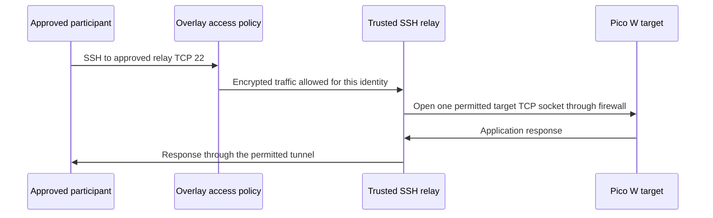

# Joining and data flow

## Separate the local boundary from remote access

The local firewall protects a site's home regardless of whether a remote session is running. Remote access adds a private, authenticated route to explicitly approved lab services. Participants do not join a home Wi-Fi network, receive home router credentials, or need a home's public address in the repository.

An overlay such as Tailscale is the first remote-access option here because it can connect devices across existing routers. Each device joins an administratively controlled network. Policies must restrict which identities reach which destinations. Tailscale's initial policy can allow broad member connectivity; installation alone is not the finished access policy. [Tailscale access control](https://tailscale.com/docs/features/access-control)

## Three connection patterns

| Pattern | Path | Use |
|---|---|---|
| Scoped TCP relay | Participant → encrypted overlay → forwarding-only SSH account → one target TCP service | Supplied strict reference for Pico and Linux HTTP exercises |
| Endpoint service | Participant → encrypted overlay → exact service port on an isolated host | First Linux exercise; private game host |
| Subnet gateway | Participant → encrypted overlay → trusted routing gateway → exact target address and port | Later alternative requiring explicit route and forwarding design |

The [supplied remote-access procedure](../network/REMOTE-ACCESS.md) implements the scoped TCP relay: it advertises no subnets and keeps Linux packet forwarding disabled. Its SSH account can open only the approved target sockets and has no shell access. The participant browses `http://127.0.0.1:18080` for Pico HTTP forwarded to target port `8080`, or `http://127.0.0.1:18081` for an approved Linux HTTP target on port `8081`. These loopback ports exist only while the participant's SSH process is running. TCP forwarding does not carry Factorio's UDP traffic.

The game launcher implements the endpoint pattern. The subnet pattern is a later alternative; a subnet router advertises selected routes, an administrator approves them, and access policy permits the intended destinations. Route approval and access permission are separate steps. [Tailscale subnet routers](https://tailscale.com/docs/features/subnet-routers)

The strict generated OpenWrt profile contains upstream, management, relay and target zones. It supplies neither a game-services zone nor the egress needed by a direct-VPN attack target. Those variants require separately reviewed segments and acceptance tests; installing another service on the relay does not provide that separation. See [the network architecture variants](../network/ARCHITECTURES.md).

Advertise only the intended target subnet or, for the smallest initial scope, an individual target `/32` route where supported. Never advertise a home subnet or a default route for these exercises. An **exit node** sends general internet traffic through another site; it is not needed for access to one lab service. [Tailscale exit nodes](https://tailscale.com/docs/features/exit-nodes)

An overlay client on a deliberately vulnerable Linux target holds device credentials. Revoke that node and reinstall the target after a compromise exercise. Use narrow target tags and prohibit target-to-target overlay connectivity unless explicitly required. A separate trusted gateway avoids putting broader network authority on the target.

## Site address plan

All rows below are synthetic. Real home subnets remain in the private plan. Validate every chosen lab subnet against each site's home, work VPN, guest and overlay routes before deployment.

| Purpose | Site A | Site B | Site C |
|---|---|---|---|
| Targets | `10.77.10.0/24` | `10.77.20.0/24` | `10.77.30.0/24` |
| Target gateway | `10.77.10.1` | `10.77.20.1` | `10.77.30.1` |
| Linux target | `10.77.10.20` | `10.77.20.20` | `10.77.30.20` |
| Pico W reservation | `10.77.10.30` | `10.77.20.30` | `10.77.30.30` |
| Dynamic target pool | `.100`–`.149` | `.100`–`.149` | `.100`–`.149` |
| Trusted relay segment | `10.78.10.0/24` | `10.78.20.0/24` | `10.78.30.0/24` |
| Relay host | `10.78.10.2` | `10.78.20.2` | `10.78.30.2` |
| Services, if configured | `10.77.11.0/24` | `10.77.21.0/24` | `10.77.31.0/24` |
| Management | `10.79.10.0/24` | `10.79.20.0/24` | `10.79.30.0/24` |
| Overlay endpoint | Assigned by overlay | Assigned by overlay | Assigned by overlay |

The service host has a services-zone address and may also have an overlay address. Those are different interfaces on the same host. The player uses the approved overlay address, while its physical uplink remains restricted by the services-zone firewall.

## Participant onboarding

1. A site operator records the target, allowed ports, exercise type, time window and stop method in the private scope record. Every participating device owner approves its inclusion.
2. The overlay administrator creates the access policy before distributing access. Separate participant and administration permissions; use individual accounts and account MFA. Enable the available device approval controls.
3. The participant installs the supported client from the provider's official instructions, signs in to the intended network and verifies the approved device identity. Enrollment keys, login links and recovery codes remain private.
4. The site operator supplies the private connection card: endpoint/name, protocol and port, expected response, permitted activity, expiry and stop contact. A public GitHub README never contains the filled card.
5. A benign connection test confirms the exact service. A second test confirms that an unapproved port is denied. Subnet access additionally confirms the expected advertised route and target address.
6. Access is revoked or narrowed after the session. Lost or compromised devices are removed from the overlay and any copied credentials are replaced.

For a Linux endpoint, `tailscale status` and `tailscale ip -4` are local diagnostic commands; their output can contain private identifiers and is not suitable for public issue reports. Installation steps should follow the current [official Tailscale installation instructions](https://tailscale.com/docs/install).

## Trace the strict reference request

The underlying home router transports encrypted traffic. It does not need a public forward to the target's application port. NAT traversal can produce a direct encrypted peer path; a relay may be used when a direct path cannot form. Actual participant connectivity must be tested from a different internet connection.

On a subnet gateway, source NAT can make the target see the gateway's address instead of the remote participant's address. Preserve identity in overlay policy and gateway logs rather than assuming the Pico's log can identify participants. Disabling that NAT requires deliberate return routes and additional testing; it is an advanced change.

## Joining private games

| Game | Join information | Access rule |
|---|---|---|
| Minecraft Java | Multiplayer → Add Server or Direct Connection → private endpoint and port | TCP 25565 |
| Factorio | Multiplayer → Connect to address → private endpoint and password | UDP 34197 |

Only supported clients with access to the private path can connect. The supplied Minecraft server is **Java Edition**. A console running Bedrock Edition is not a Java client, and this guide does not assume that a PS5 supports adding an arbitrary server address or running the overlay client. A Bedrock deployment is a separate compatibility project using the [official Bedrock dedicated server](https://www.minecraft.net/en-us/download/server/bedrock), including its own platform/client checks and port policy.

Raw WireGuard with a reachable endpoint, a hosted VPN hub and public port forwarding are later alternatives. They need explicit key distribution, route design, endpoint reachability and firewall policy. A hosted hub also introduces another administrator and cost. Neither option should be used merely to avoid resolving a local isolation failure.
