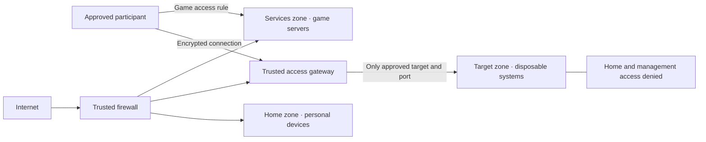

# The isolated network lab

Three sites. One repeatable pattern. A protected home network beside a disposable learning network.

This handbook describes a small collaborative lab for networking exercises, microcontroller projects and private game servers. Every address and site label in this public edition is an invented example. Device identities, account names, photographs, connection endpoints and secrets belong in a separate local configuration.

The central rule is simple: **a device under attack must not also be responsible for protecting the home**. The boundary remains trusted even when a target router, Linux system or microcontroller has been compromised.

## Read in this order

| Stage | Question answered | Reading |
|---|---|---|
| 1 · Understand | What are the parts, and what does an address mean? | [Network foundations](01-foundations.md) |
| 2 · Choose | One router, two routers, VLANs, DMZ or a tunnel? | [Architecture choices](02-architectures.md) |
| 2a · Platform | What differs between pfSense, OPNsense and OpenWrt? | [Firewall platforms](PLATFORMS.md) |
| 3 · Prepare | Which hardware can actually perform each job? | [Hardware and build order](03-build.md) |
| 4 · Connect | How do participants reach an approved target? | [Joining and data flow](04-connect.md) |
| 5 · Verify | What proves that the home remains separated? | [Acceptance and exercises](05-validation.md) |
| 6 · Operate | How do updates, resets, games and recovery work? | [Operations](06-operations.md) and [game-server code](../games/README.md) |
| Reference | What information must be recorded? | [Worksheets](07-worksheets.md) and [sources](SOURCES.md) |
| Later exercise | How is an owned router's firmware investigated? | [Firmware analysis](FIRMWARE-ANALYSIS.md) |

## The destination

The figure shows logical boundaries; it does not require one physical box per rectangle. Solid arrows show a permitted path. The final line names a prohibition, not a cable. The interactive architecture view supplies scenario-specific wiring and addresses.

The first usable stage is an **offline island**: an experimental router or switch, a lab-only computer and microcontrollers, with no home uplink. Remote access comes after the isolation checks pass. An always-on Linux computer is needed for the supplied gateway and game workflows; an Arduino Uno and Raspberry Pi Pico W cannot fill that role.

Two further options appear in the scenario view: **edge**, with a trusted firewall ahead of the home router on a separately filtered HOME interface; and **split**, with independent home/lab router WANs on a WAN-only switch. The split design requires a verified ISP handoff allowing both connections. An unmanaged switch creates neither public addresses nor firewall isolation. Their [architecture details](02-architectures.md) state the missing conditions explicitly.

## What the code can and cannot establish

The supplied templates make the intended configuration reviewable. They do not establish hardware support, physically separate switch ports, or prove that a firewall is effective. Generated plans and successful syntax checks are preparation. The acceptance worksheet records the tests that must pass on the actual equipment.

No public target is required. The public repository is a teaching resource. The private participant connection card supplies the small amount of real connection information needed during an approved session.
