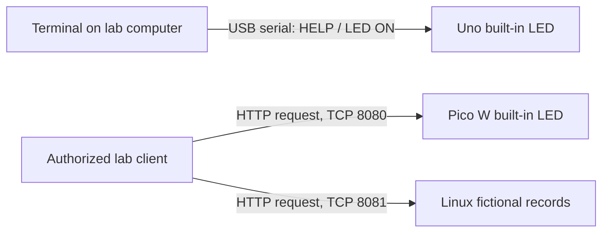

# Hardware and application lessons

Start with the USB serial lesson. Add the Pico W only after the lab network's isolation checks pass. The Linux lesson can run on one computer without any network changes.

| Device | Role in these lessons | Connection | Software |
| --- | --- | --- | --- |
| Classic Arduino Uno / Uno R3, ATmega328P | A small command terminal controlling the built-in LED | USB cable to a computer | Arduino sketch |
| Raspberry Pi Pico W, RP2040 | A tiny web service controlling the built-in LED | USB for programming; isolated lab Wi-Fi for requests | MicroPython |
| Linux Raspberry Pi computer or Linux PC | A fictional record service with a deliberate missing ownership check | Loopback first; verified lab interface later | Python 3.10+ standard library |

The Uno R3 has no built-in Wi-Fi. A Pico W is a microcontroller and does not run Linux; Minecraft and Factorio servers require a suitable computer, not either of these microcontrollers. A Linux-capable Raspberry Pi is a different product. [Arduino board comparison](https://support.arduino.cc/hc/en-us/articles/9350551575964-What-s-the-difference-between-UNO-R3-and-UNO-R4-boards), [Raspberry Pi board distinction](https://www.raspberrypi.com/documentation/microcontrollers/pico-series.html).

All examples affect LEDs or fictional records. Use USB power and the onboard LEDs without additional wiring. Uno R3 logic operates at 5 V; Pico W GPIO operates at 3.3 V. Connecting Uno transmit/output pins directly to Pico inputs can damage the Pico. Interconnecting those boards needs a suitable level shifter and an agreed pinout. Motors need an identified driver, suitable supply and protection; no motor circuit is included. [Uno specifications](https://store.arduino.cc/products/arduino-uno-rev3), [Pico W datasheet, section 3.2](https://datasheets.raspberrypi.com/picow/pico-w-datasheet.pdf), [Raspberry Pi GPIO guidance](https://www.raspberrypi.com/documentation/computers/raspberry-pi.html#gpio-and-the-40-pin-header).



The web services are intentionally small teaching programs. Token mode checks possession of a secret. The Linux `secure` mode adds a record ownership check. Neither mode adds HTTPS, comprehensive denial-of-service protection, or production hardening. Python's standard HTTP server is itself intended for basic uses rather than production deployment. [Python HTTP server documentation](https://docs.python.org/3/library/http.server.html).

## Keep runnable settings private

Commands below run in Bash from the **shared repository root**: the directory containing `firmware/`. In the complete local bundle this is `share/`. In a standalone GitHub clone it is the clone root. `../private/` is a separate local directory outside that root.

```bash
mkdir -p ../private/firmware/pico_w
chmod 700 ../private ../private/firmware ../private/firmware/pico_w
cp -n firmware/pico_w/config.example.py ../private/firmware/pico_w/config.py
chmod 600 ../private/firmware/pico_w/config.py
```

`cp -n` retains any existing private configuration. Keep the public example unchanged. The private folder contains Wi-Fi credentials, lesson tokens and actual addresses entered during operation. It is excluded from the shareable source, even when the public source is copied to a fresh GitHub repository.

## Lesson 1 — USB terminal on an Uno

A serial terminal sends characters along a connection. Here the computer's USB port reaches the Uno's serial interface. The board reads a line and recognizes a short list of commands. This is an application command interface; it is not a Linux shell and it provides no network access.

1. Install Arduino IDE from the [official Arduino software page](https://www.arduino.cc/en/software). Connect an Uno with a USB data cable.
2. Confirm the board is a classic Uno / Uno R3 with ATmega328P. An Uno R4 or Uno WiFi board has different hardware; verify its board package separately.
3. Open `firmware/uno_serial/uno_serial.ino`. Retain `commands.h` in the same folder.
4. In Boards Manager install **Arduino AVR Boards** if absent. Select **Arduino Uno**, then the port belonging to the attached board. Upload the sketch. [Arduino upload instructions](https://support.arduino.cc/hc/en-us/articles/4733418441116-Upload-a-sketch-in-Arduino-IDE).
5. Open Serial Monitor. Set **115200 baud** and **Newline**. Baud is the signaling rate; both ends must agree. `CRLF` also works. [Arduino Serial reference](https://github.com/arduino/reference-en/blob/master/Language/Functions/Communication/Serial/begin.adoc).
6. Send each command below as one uppercase line.

| Command | Expected result |
| --- | --- |
| `HELP` | The supported command list |
| `PING` | `PONG` |
| `STATUS` | LED state and milliseconds since startup |
| `LED ON` | Built-in LED lights; `OK LED ON` |
| `LED OFF` | Built-in LED turns off; `OK LED OFF` |
| `LED ON; STATUS` | Unknown command; no compound commands run |

Input is bounded to 63 printable ASCII characters. Oversized or nonprintable lines are discarded entirely until the next line ending. The next valid line works normally. `UPTIME_MS` eventually wraps because the Arduino counter is finite; it is only a demonstration reading.

There is no networking in this sketch and no extra library dependency. Remote serial access requires a lab computer connected by USB and a separately scoped serial transport with explicit permissions. The baseline VPN policy grants no participant shell on that computer, and the forwarding-only relay account cannot start a shell. This USB lesson remains local until that additional transport is designed and checked. See the [remote-access boundaries](../network/REMOTE-ACCESS.md).

Optional CLI verification with Arduino CLI installed:

```bash
arduino-cli core update-index
arduino-cli core install arduino:avr
arduino-cli compile --fqbn arduino:avr:uno firmware/uno_serial
arduino-cli board list
```

Use the port shown for the board in the IDE. Serial port permission errors should be resolved using the operating system's device-access configuration, not by running the whole IDE as root. [Arduino CLI serial and permission guidance](https://docs.arduino.cc/arduino-cli/FAQ).

## Lesson 2 — Pico W HTTP and access control

HTTP is the request/response language used by web clients. The address selects the device, the port selects the listening service, and the path selects an action. This program listens at the Pico's assigned IPv4 address on TCP port `8080`.

### Install MicroPython and verify the board

1. Download a stable UF2 specifically for **Raspberry Pi Pico W** from the [official MicroPython Pico W page](https://micropython.org/download/RPI_PICO_W/). At the documentation check on 2026-09-11, that page listed v1.29.0 as the latest stable release. Record the installed version locally; avoid preview firmware for the initial lesson.
2. Disconnect the board. Hold **BOOTSEL** while connecting USB, release when the `RPI-RP2` drive appears, then copy the UF2 onto that drive. The board restarts. [Official installation sequence](https://www.raspberrypi.com/documentation/microcontrollers/micropython.html).
3. Install [Thonny](https://thonny.org/). Select the MicroPython Raspberry Pi Pico interpreter and the Pico's USB port. Where a separate Pico W choice appears, select it.
4. In Thonny's Shell, run the following. The implementation information should identify a Pico W; the `network` module must import.

```python
import sys
import os
import network
print(sys.implementation)
print(os.uname())
from machine import Pin
led = Pin("LED", Pin.OUT)
led.on()
led.off()
```

The USB Shell is a **REPL**, an interactive Python prompt. It is local programming access, so commands entered there run directly on the board. The Pico W's LED is selected by `Pin("LED")`; a non-wireless Pico's GPIO25 example is not the same wiring. [MicroPython RP2 reference](https://docs.micropython.org/en/v1.29.0/rp2/quickref.html).

### Fill the private configuration

Edit `../private/firmware/pico_w/config.py`. Do not put operational credentials in `config.example.py`.

| Setting | Meaning | Initial choice |
| --- | --- | --- |
| `ENABLE_NETWORK` | Explicit permission for this program to join Wi-Fi | Keep `False` until the remaining fields and lab isolation are checked, then `True` |
| `WIFI_SSID` | Name of the isolated lab wireless network | Dedicated lab SSID |
| `WIFI_PASSWORD` | Password for that wireless network | Dedicated strong lab password |
| `COUNTRY` | Installation country's two-letter uppercase radio code | Replace `XX` with the applicable code |
| `PORT` | TCP service port | `8080` |
| `MODE` | Application authentication behavior | `"token"` |
| `ALLOW_UNAUTHENTICATED_LAB` | Extra enable switch for deliberately missing authentication | `False` |
| `API_TOKEN` | A secret possessed by authorized clients | Fresh random value generated below |

Generate a disposable token in the local computer's terminal, then copy it into the private file:

```bash
python3 -c 'import secrets; print(secrets.token_hex(32))'
```

Use the isolated network's 2.4 GHz SSID; Pico W does not use a 5 GHz-only network. WPA2-Personal compatibility is a practical starting point. Application `MODE="lab"` does **not** require removing the Wi-Fi password. [Pico W wireless specifications](https://pip-assets.raspberrypi.com/categories/686-raspberry-pi-pico-w/documents/RP-008313-DS-1-pico-w-product-brief).

In Thonny, save these three files to the root of the **Raspberry Pi Pico** device filesystem:

| Local source | Filename on the Pico |
| --- | --- |
| `firmware/pico_w/http_core.py` | `http_core.py` |
| `../private/firmware/pico_w/config.py` | `config.py` |
| `firmware/pico_w/main.py` | `main.py` |

Run `main.py`, or restart the board after saving. The program keeps Wi-Fi off if the private configuration is missing, disabled or still contains placeholders. A valid configuration has a 20-second join deadline. The USB output reports a local URL when connection succeeds; that actual address belongs in the private worksheet only. It can change after a restart unless the lab router reserves a DHCP lease.

### Try one authorized device

Choose the connection path first. For a local test, use a computer inside the isolated lab and enter the Pico's **IPv4 address only**, without an `http://` prefix or port:

```bash
read -r -p 'Pico lab IPv4 address: ' LAB_PICO_IP
LAB_PICO_URL="http://$LAB_PICO_IP:8080"
```

For a remote participant, first open the Pico SSH forward described in [remote access](../network/REMOTE-ACCESS.md#participant-connection-procedure), keep that process running, and set the following in a second terminal instead. The strict architecture supplies an application forward; it does not route the remote lab subnet to the participant.

```bash
LAB_PICO_URL='http://127.0.0.1:18080'
```

Then run the same requests for either path. Bash's silent token prompt avoids writing the token as a literal command in history. The header goes to curl over standard input instead of becoming a curl command-line argument.

```bash
read -r -s -p 'Pico API token: ' LAB_PICO_TOKEN
printf '\n'
printf 'Authorization: Bearer %s\n' "$LAB_PICO_TOKEN" |
  curl --noproxy '*' --max-time 5 -i --header @- "$LAB_PICO_URL/status"
printf 'Authorization: Bearer %s\n' "$LAB_PICO_TOKEN" |
  curl --noproxy '*' --max-time 5 -i --header @- -X POST "$LAB_PICO_URL/led/on"
printf 'Authorization: Bearer %s\n' "$LAB_PICO_TOKEN" |
  curl --noproxy '*' --max-time 5 -i --header @- -X POST "$LAB_PICO_URL/led/off"
curl --noproxy '*' --max-time 5 -i "$LAB_PICO_URL/status"
unset LAB_PICO_TOKEN
```

The first three responses should be `200`; the last should be `401`. `200` means the request succeeded. `401` means valid authentication was missing. A `GET` request reads state; a `POST` changes it. Token checks happen before LED changes. Request bodies are unsupported.

For the deliberately unauthenticated exercise, first confirm the Pico is still inside the isolated target network. Change the **private** configuration to `MODE="lab"` and `ALLOW_UNAUTHENTICATED_LAB=True`, upload it and restart. Repeat the following exact-device request:

```bash
curl --noproxy '*' --max-time 5 -i -X POST "$LAB_PICO_URL/led/on"
```

The LED changes without a token. This demonstrates **missing authentication**: a reachable client can operate the service without proving possession of a secret. Restore `MODE="token"` and `ALLOW_UNAUTHENTICATED_LAB=False`, upload, restart, and repeat the request; it should return `401` and leave the LED unchanged.

**A bearer token is not encryption.** This program sends HTTP in plaintext. An observer who can see the application traffic can read and replay the token. WPA2 protects a radio link, and a VPN protects traffic between its endpoints. In the strict architecture the VPN and SSH connections end at the relay; the HTTP connection from relay through the firewall to Pico remains plaintext at the application layer. Token mode demonstrates a narrower access rule, not end-to-end confidentiality. Do not reuse any household, account or router password as an API token.

Stop with Thonny's Stop/Ctrl+C, or disconnect power. Normal exit disables Wi-Fi and turns the LED off. Before the next boot, setting `ENABLE_NETWORK=False` and saving the private `config.py` to the device keeps the program offline. Back up files before reflashing firmware: a UF2 reflash should not be treated as proof that old stored secrets were erased.

## Lesson 3 — Linux record ownership

This service runs on a Linux computer, including an appropriate Linux Raspberry Pi, with Python 3.10 or newer. No Python packages, container runtime, root privileges or GPIO wiring are needed.

**Authentication** identifies a client. **Authorization** determines what that identity may access. The lesson authenticates identities named `alpha` and `beta` using generated tokens. It holds two fictional records in memory. In `insecure` mode, either authenticated identity can read both records. In `secure` mode, each identity can read only its own record.

Create private tokens and run the initial local exercise:

```bash
python3 --version
mkdir -p ../private/firmware
chmod 700 ../private ../private/firmware
python3 firmware/linux_target/create_tokens.py ../private/firmware/lesson-tokens.json
python3 firmware/linux_target/server.py --mode insecure \
  --tokens-file ../private/firmware/lesson-tokens.json
```

The token generator creates a file readable only by its owner, refuses output inside the public repository, rejects symlink path components and never replaces an existing file. It requires a POSIX system with no-follow file access. An existing lesson file can be reused. The service binds to `127.0.0.1`, the **loopback** address meaning this same computer, on TCP port `8081`. It is initially unreachable from another computer.

In a second Bash terminal at the shared repository root:

```bash
LAB_LESSON_TOKEN="$(python3 -c 'import json; print(json.load(open("../private/firmware/lesson-tokens.json"))["alpha"])')"
printf 'Authorization: Bearer %s\n' "$LAB_LESSON_TOKEN" |
  curl --noproxy '*' --max-time 5 -i --header @- http://127.0.0.1:8081/records/1
printf 'Authorization: Bearer %s\n' "$LAB_LESSON_TOKEN" |
  curl --noproxy '*' --max-time 5 -i --header @- http://127.0.0.1:8081/records/2
```

Both requests return `200`. Changing only `1` to `2` exposed a record owned by a different identity. This is an **insecure direct object reference (IDOR)**: the server accepted a user-chosen record identifier without checking ownership.

Stop the server with Ctrl+C. Restart with the ownership check enabled:

```bash
python3 firmware/linux_target/server.py --mode secure \
  --tokens-file ../private/firmware/lesson-tokens.json
```

Repeat the two curl commands. Record `1` remains `200`; record `2` becomes `403`, meaning an authenticated request is forbidden. Omitting the token produces `401` in either mode. A nonexistent record produces `404`. The change is the owner comparison immediately before returning a record in `server.py`.

To repeat through the strict SSH relay, complete the [remote-access procedure](../network/REMOTE-ACCESS.md#participant-connection-procedure), including the explicit Linux service grant in the firewall and relay's `PermitOpen`. On the target's local console, stop the loopback server, choose its **exact lab IPv4 address**, and enable a listener on that interface:

```bash
read -r -p 'Target lab IPv4 address: ' LAB_TARGET_IP
python3 firmware/linux_target/server.py --mode insecure \
  --bind "$LAB_TARGET_IP" --allow-lab-listener \
  --tokens-file ../private/firmware/lesson-tokens.json
```

The participant opens the Linux SSH forward from the remote-access guide, which maps participant `127.0.0.1:18081` to target TCP `8081`, and keeps it running. Receive only the `alpha` lesson token through a private channel; the full two-identity token file stays on the target. In a second participant terminal:

```bash
read -r -s -p 'Alpha lesson token: ' LAB_LESSON_TOKEN
printf '\n'
printf 'Authorization: Bearer %s\n' "$LAB_LESSON_TOKEN" |
  curl --noproxy '*' --max-time 5 -i --header @- http://127.0.0.1:18081/records/1
printf 'Authorization: Bearer %s\n' "$LAB_LESSON_TOKEN" |
  curl --noproxy '*' --max-time 5 -i --header @- http://127.0.0.1:18081/records/2
```

The strict route gives no direct participant access to the target's lab IP. The optional [direct-VPN Linux target](../network/REMOTE-ACCESS.md#direct-linux-target-and-game-variants) instead uses its own contained segment, target VPN role and reviewed Internet egress; that segment is not created by the strict firewall profile. Only in that separately configured variant does the participant use the target's VPN IPv4 address on port `8081`.

This program does not configure the firewall, establish a tunnel, advertise a subnet, or create an internet port forward. Its HTTP traffic has the same plaintext limitation as the Pico lesson.

Stop with Ctrl+C, remove temporary firewall grants and revoke the lesson token after the session. `unset LAB_LESSON_TOKEN` clears the variable in the participant terminal. These records never persist to disk and the service contains no shell command, arbitrary file read or upload endpoint. A fresh isolated VM or lab computer is the appropriate host for later exercises involving more vulnerable applications.

## Troubleshooting and verification

| Symptom | First checks |
| --- | --- |
| Uno does not appear as a port | USB data cable, selected board package, OS device permissions; close other serial programs |
| Uno shows garbage characters | Monitor baud rate must be `115200` |
| Uno accepts nothing | Select Newline; commands are uppercase |
| Pico says configuration rejected | A private `config.py` exists on the board; all required values and enable switches are set |
| Pico cannot join Wi-Fi | Exact isolated SSID/password, 2.4 GHz availability, applicable country code |
| Pico LED example fails | Correct Pico W UF2 and `Pin("LED")` |
| curl times out | Current target address, same verified lab or permitted tunnel path, correct service port, running program, firewall policy |
| Pico is reachable locally but not remotely | Gateway route and return path, explicit tunnel permissions, target firewall; a tunnel does not grant all routes automatically |
| `401` with a token | Exact token, `Bearer` header, updated private config on the device, no obsolete environment variable |
| Linux bind fails | Address must exist on this target; the chosen port must be free |

Automated checks from the shared repository root:

```bash
python3 -m unittest discover -s firmware/tests -p 'test_*.py' -v
g++ -std=c++11 -Wall -Wextra -pedantic firmware/tests/test_uno.cpp -o /tmp/lab-uno-parser-test
/tmp/lab-uno-parser-test
```

Validation performed during preparation: **19 Python tests passed on CPython 3.12.3**, including live loopback requests against both Linux modes, missing-token denial, Pico parser framing/size checks, prevention of unauthorized LED state changes, and private token-file boundaries and permissions. The Uno parser compiled with **g++ 13.3.0** and passed CRLF, overflow, invalid-input and recovery checks.

Those checks validate host-side behavior. Arduino CLI/AVR compilation, flashing, electrical operation, Pico MicroPython execution, wireless association, and the actual network's isolation require the listed hardware checks; they were not performed on physical boards. MicroPython compatibility was checked against official APIs, including `WLAN()`, `ipconfig("addr4")`, and socket methods; a fallback is included for older `ifconfig()` firmware. [MicroPython networking reference](https://docs.micropython.org/en/v1.29.0/rp2/quickref.html), [MicroPython socket reference](https://docs.micropython.org/en/v1.26.0/library/socket.html).
