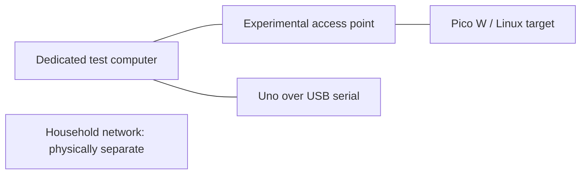
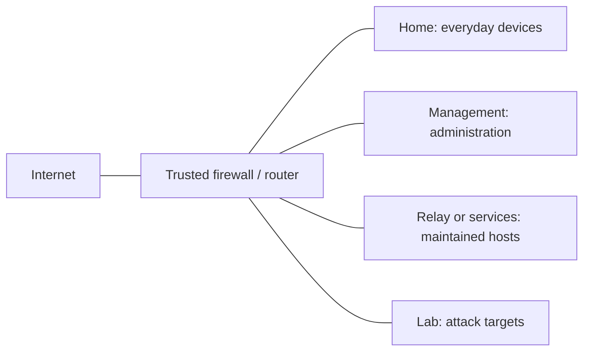
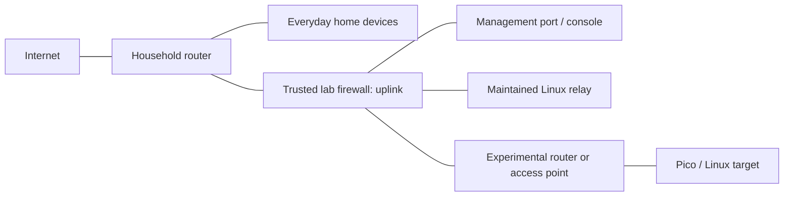
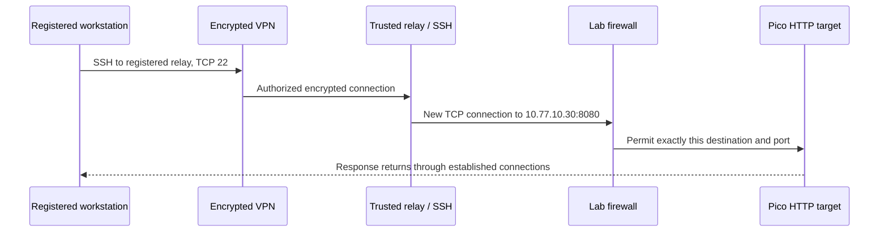

# Architecture and vocabulary

## Start with the physical path

A device sends a small unit of data, a **packet**, toward another device. Devices on the same local network can often communicate directly. Traffic crossing between networks goes through a **router**. A **firewall** applies rules to that crossing.

An **IP address** identifies a network interface. A **subnet** is a range treated as one local network: `10.77.10.0/24` contains addresses `10.77.10.0` through `10.77.10.255`. In this example, `.0` names the subnet, `.255` is its broadcast address, `.1` is the router, and `.20`/`.30` are targets. `/24` is the **CIDR prefix**; a longer prefix describes a smaller range. A device's **default gateway** is the router used for destinations outside its subnet.

**DHCP** supplies addresses automatically. A **reservation** makes the DHCP server assign a predictable address to a particular client. **DNS** translates names into addresses. **TCP** and **UDP** are transport protocols. A **port** identifies a service, such as TCP port 80 for ordinary HTTP. TCP port 80 and UDP port 80 are different permissions.

The examples use private IPv4 ranges, which are reusable inside local networks. These ranges do not by themselves confer trust. The example public address `203.0.113.10` is reserved for documentation and is not a working endpoint. [IETF private address ranges](https://www.rfc-editor.org/rfc/rfc1918), [IETF documentation address ranges](https://www.rfc-editor.org/rfc/rfc5737).

## 1. Offline bench: first working experiment

The experimental router's WAN socket remains empty. It has no wireless repeater, mesh, WISP, cellular or USB tether connection to the household or Internet. The test computer disconnects from household Wi-Fi and Ethernet; Internet Connection Sharing and network bridges are disabled. A second computer is preferable to a daily laptop containing credentials.

Example: router LAN `10.77.10.1/24`, test computer `.10`, Linux target `.20`, Pico `.30`. A dedicated test SSID uses a new password. WPA2-AES or a supported stronger mode is suitable for the network itself; intentionally weak HTTP can still be studied inside it. Weakening Wi-Fi creates a radio exposure extending beyond the room. Wired tests are preferable for exercises that do not need radio.

An Uno talks through its programmed serial interface. It has no native IP network; its USB-connected computer becomes the network endpoint if a bridge service is added. USB attachment is a physical path across a boundary, so the attached computer belongs to the lab during exercises.

## 2. One capable firewall

This works when the router can create separate interfaces or **VLANs**, attach each to a separate firewall **zone**, and filter both IPv4 and IPv6. A VLAN separates Ethernet traffic on a shared managed switch. A zone groups interfaces under firewall rules. A VLAN without appropriate routing rules is incomplete isolation; different Wi-Fi names alone are also insufficient. A guest network requires verification against wired home devices, router administration, other guests and IPv6.

An **access port** carries one chosen network to an ordinary device. A **trunk** carries multiple tagged VLANs between trusted network devices. Attack-target ports must be access ports with only their lab VLAN admitted, and unneeded VLAN memberships removed. Unmanaged switches cannot substitute for verified VLAN enforcement. Port mapping and DSA/switch configuration vary by hardware. [OpenWrt DSA configuration](https://openwrt.org/docs/guide-user/network/dsa/dsa-mini-tutorial), [Linux DSA documentation](https://www.kernel.org/doc/html/latest/networking/dsa/configuration.html).

The dedicated firewall generator in this folder is **not** a replacement configuration for a shared household gateway. A shared gateway requires an additional home zone and a reviewed equivalent of the permissions table below.

## 3. Dedicated boundary behind a household router

The firewall's uplink is a household LAN client. Its lab-facing segment is a separate network. Lab-originated traffic toward the upstream household must be blocked even though it exits the firewall's WAN/uplink port. “Allow LAN to WAN” on the inner router commonly permits that traffic. Default NAT on the inner router does not solve this.

For the first online deployment, the experimental router acts only as a lab access point: DHCP off, isolated lab Ethernet into a **LAN** port, WAN empty. Its management address belongs to the lab. When its router/WAN behavior is itself under test, connect its WAN only to the trusted firewall's lab port and give its downstream LAN another non-overlapping subnet. Leave this routing experiment offline until the new routes and service forwards have been explicitly planned. Any exploit against the experimental router must still remain downstream of the trusted boundary.

The strict reference has four logical networks: uplink, management, relay and lab. Four independent ports are straightforward. Three ports are sufficient only with a local serial/video console replacing the management network, or a supported managed VLAN arrangement. A three-port device does not automatically provide four isolated networks. The supplied generator expects all four interfaces; a console-only variant requires a reviewed configuration removing `mgmt` and its rules. Unknown appliances are inspected before firmware or port assignments are chosen.

## 4. Remote tunnel: connection permission is separate from containment

The VPN is an encrypted private path across the Internet. It does not turn the receiving household network into an isolated lab. The strict design puts the VPN on a maintained relay, and gives the relay permission to open only named target services. The Pico runs no VPN software. The HTTP leg between the relay and the Pico is plaintext inside the lab; this is the intended place for a traffic-observation exercise.

A host VPN installed directly on a Linux target is simpler for many protocols, but that target then needs outbound VPN connectivity and holds a VPN identity. A compromised target may use its permitted Internet egress and credentials. It remains inside the lab firewall, receives no privileges to contact other VPN nodes, and is re-enrolled with a new identity after destructive exercises. The strict default instead keeps target egress closed and uses the relay for a specified TCP service.

No home subnet is advertised to the VPN. A **subnet router** would advertise reachability to devices behind it; an **exit node** would carry general Internet traffic. Neither is part of the baseline. [Tailscale subnet routers](https://tailscale.com/docs/features/subnet-routers), [Tailscale exit nodes](https://tailscale.com/docs/features/exit-nodes).

## 5. Games as maintained services

Game servers belong on a clean service host or service VLAN, separate from machines being intentionally compromised. Host VPN access exposes the required game port to registered players. It need not expose a shell or router administration. The public policy includes Minecraft Java TCP `25565` and Factorio UDP `34197`; versions, edition, platform support and installation belong to the game guide. A TCP-only SSH forward cannot carry Factorio's UDP traffic.

The strict OpenWrt profile has a relay zone, not a full game-services zone. A separate game host needs its own service zone and explicit egress rules, or the documented one-capable-firewall service scenario. Co-hosting games and an SSH relay joins their trust boundaries and is not the reference design. Game-server backups and accounts are kept outside attack-target images.

## DMZ, port forwarding, NAT and CGNAT

**NAT** rewrites addresses as packets cross a router. **Port forwarding** deliberately sends selected incoming traffic to an inside host. Many consumer routers call an “all unsolicited incoming traffic to one host” setting **DMZ host**. That setting does not create an isolated network and must remain off for this baseline. A real **DMZ network** is a separate firewall zone with explicit restrictions toward home and management.

**Double NAT** means two successive address translations; it can complicate inbound connections, while still allowing the inner client to reach the outer LAN. **CGNAT** means the Internet provider also translates a shared public address. A home port-forward alone generally cannot open an inbound IPv4 service through that provider layer. Tunnels with relay fallback avoid requiring an unsolicited inbound port, though they still need outbound access. [Tailscale NAT traversal explanation](https://tailscale.com/blog/how-nat-traversal-works), [Tailscale connection types](https://tailscale.com/docs/reference/connection-types).

## Address plan and permissions

All values below are synthetic. Replace any conflicting subnet across every related configuration. A subnet clash can send traffic to the wrong local network before any VPN route is used.

| Role | Site A | Site B | Site C |
|---|---|---|---|
| Lab | `10.77.10.0/24` | `10.77.20.0/24` | `10.77.30.0/24` |
| Relay | `10.78.10.0/24` | `10.78.20.0/24` | `10.78.30.0/24` |
| Management | `10.79.10.0/24` | `10.79.20.0/24` | `10.79.30.0/24` |
| Gateway in each segment | `.1` | `.1` | `.1` |
| Linux target / Pico | `.20` / `.30` | `.20` / `.30` | `.20` / `.30` |
| Relay / management workstation | `.2` / `.2` | `.2` / `.2` | `.2` / `.2` |

| Initiator → destination | Strict reference decision |
|---|---|
| Lab → home, management, relay or Internet | Deny new connections, both IP families |
| Lab → firewall | IPv4 DHCP only; no DNS or administration |
| Relay → named target | Permit specified TCP service only |
| Relay → upstream home or protected public home address | Deny |
| Relay → public Internet | Off initially; optional TCP 443 for VPN/HTTPS |
| Relay → firewall | IPv4 DHCP and DNS only |
| Management workstation → firewall | SSH and HTTPS only |
| Management workstation → relay | SSH only |
| Registered VPN client → relay | SSH network access plus separate forwarding-account authentication |
| Unregistered Internet client → any lab service | No port forwards; deny |
| Replies to a permitted connection | Allow through state tracking |

**Ingress** means arriving traffic; **egress** means departing traffic. Denying inbound connections alone leaves the egress path open. For example, an infected target could call a public server on TCP 443 if that port were allowed. The strict profile permits that egress only from the trusted relay. The firewall itself has normal outbound access and must stay patched and outside exercise scope.

**IPv6** is another IP protocol, with different address sizes and frequently a separate routed path. A policy checked only with IPv4 cannot establish IPv6 containment. The baseline disables delegated lab IPv6 and grants no routed IPv6 access. Local IPv6 link-local traffic can still exist inside a lab segment. Encrypted VPN IPv6 addresses are governed by the VPN policy and do not require enabling upstream IPv6 routing.
