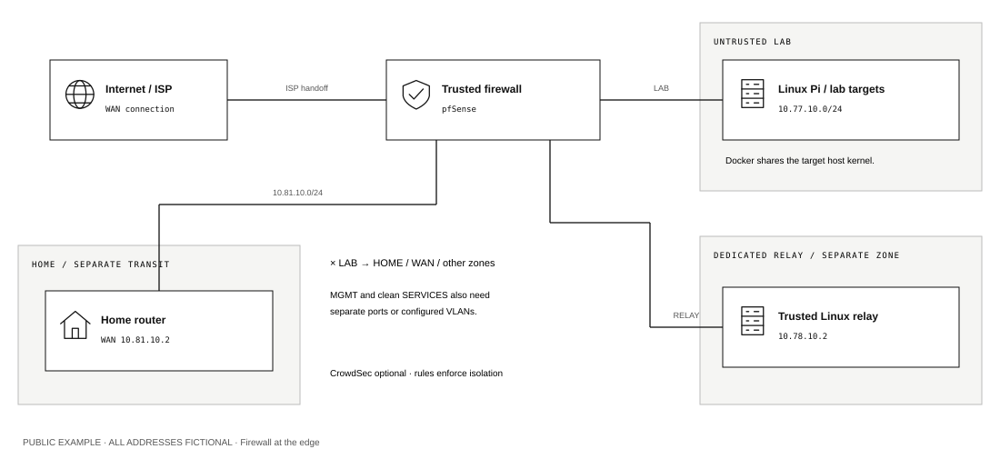
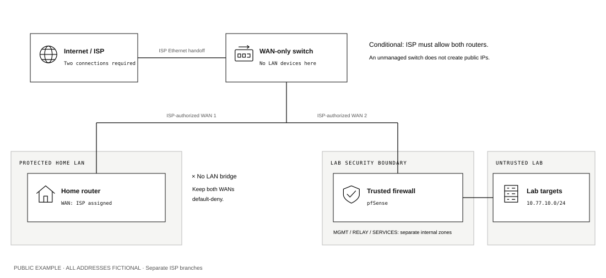

# pfSense or OPNsense: edge, split-uplink and behind-router designs

Three designs can separate a household from a shared attack lab. The **edge design** places one trusted firewall before the household router and the lab. The **split-uplink design** gives the household router and lab firewall separate upstream connections; it works only when the Internet provider's handoff supports both connections concurrently. A dedicated firewall **behind the household router** preserves the existing Internet connection and contains the lab on separate internal networks.

This guide turns those general diagrams into interface assignments, rule order and acceptance checks. It does not identify an unknown appliance, assume an ISP allocation, or supply an importable firewall configuration. The addresses are synthetic. Operational addresses, backup files, keys and screenshots remain private.

## Select the platform and hardware

pfSense and OPNsense are firewall operating systems. They can enforce similar network policies, but their interfaces, packages and configuration formats differ. Select one maintained installation and follow its own installation and recovery documentation. The OpenWrt UCI generator in this repository cannot configure either platform; its output is not a BSD firewall script or an XML import.

For ordinary third-party hardware, current pfSense requires supported 64-bit x86 hardware; Netgate also supplies specific supported appliances. A generic Raspberry Pi or an unidentified small router is not thereby a pfSense platform. OPNsense's published hardware architecture is amd64/x86-64. Verify processor, RAM, storage, network-interface support and console access against the selected platform before acquiring or installing it. Minimum specifications are not throughput or intrusion-inspection capacity promises. [Netgate hardware compatibility](https://docs.netgate.com/pfsense/en/latest/hardware/), [pfSense minimum requirements](https://docs.netgate.com/pfsense/en/latest/hardware/minimum-requirements.html), [OPNsense hardware requirements](https://docs.opnsense.org/manual/hardware.html).

The reference uses separate management, relay, target and game-service networks. Physical ports can provide those networks, or a supported managed switch can carry explicitly assigned VLANs. A diagram containing three VLAN lines does not establish that a three-port appliance can implement every role without additional equipment. A trunk carries multiple VLANs only between trusted devices; target ports admit only their assigned lab VLAN.

## Design A: a trusted firewall at the Internet edge

The household router remains in router mode: its WAN connects to `HOME_TRANSIT`, and its LAN/Wi-Fi continue serving the actual household subnet. Keep its WAN remote administration, consumer DMZ-host setting and automatic port mapping disabled for the reference. Nothing connects a household LAN socket to the firewall's LAB or SERVICES network.

`HOME_TRANSIT` is the short network between the two routers. It is not the household LAN. With IPv4 NAT on both routers, home traffic undergoes **double NAT**. This can affect incoming connections, console NAT-type reporting and some peer-to-peer applications; it is not evidence that the lab is isolated. A household AP/bridge-mode alternative removes the inner routing boundary and requires the edge firewall to serve the household LAN directly. That is a separate migration, not an interchangeable port choice. [pfSense outbound NAT](https://docs.netgate.com/pfsense/en/latest/nat/outbound.html), [OPNsense NAT behavior](https://docs.opnsense.org/manual/nat.html).

The edge firewall now carries household Internet traffic. Its updates, reboot, mistakes and resource exhaustion can interrupt the household. Lab isolation does not guarantee bandwidth or CPU isolation. Keep the firewall outside the attack scope and schedule the initial cutover when an interruption is acceptable.

## Design B: split the provider handoff before the routers

An unmanaged switch can fan out an Ethernet handoff. It does not allocate public addresses, perform NAT, or isolate its own switch ports. In this design its connected ports are **only** the ISP handoff and the two trusted WAN interfaces. No household LAN, target, Pico, management computer or services-host Ethernet connection belongs on that switch. Never combine these LANs with the WAN using an unmanaged switch. A managed WAN VLAN is an advanced alternative and must be excluded from every internal access port and from ordinary switch management.

Before choosing this layout, obtain the provider's actual delivery details:

| Provider arrangement | Consequence |
|---|---|
| One DHCP lease or one permitted customer device | A switch does not produce a second usable connection; use the edge or behind-router design |
| Two simultaneous public DHCP leases explicitly permitted | Each router WAN obtains its own lease; verify both renew while the other is connected |
| Multiple static addresses on the same upstream link | Each WAN uses a different provider-authorized address, prefix and gateway; no addresses are invented |
| A public block routed to one assigned WAN address | The block arrives through that router; it is not a promise of multiple DHCP leases or direct addresses on the handoff switch |
| PPPoE, provider VLANs, registered equipment or other authentication | Independent sessions and interface tagging require provider support and exact settings |
| Upstream equipment issues private WAN addresses | This is a shared upstream routed/NAT network, not two directly assigned public IPs; record the actual topology and upstream restrictions |

These are different address-delivery models. Additional public addresses may need routing or virtual-IP/NAT arrangements on a single firewall, rather than parallel routers. Nothing in the diagrams establishes which service the provider supplies. [Netgate methods for additional public addresses](https://docs.netgate.com/pfsense/en/latest/firewall/additional-ip-addresses.html).

The two WANs share an untrusted Ethernet segment, even when they have different public addresses. Neither WAN exposes administration there. Add the household router's actual WAN/public IPv4 addresses to the lab firewall's protected-destination alias before permitting relay or game-host egress. IPv6 requires the corresponding protection if later enabled. Dynamic addresses must be kept current; stop the affected egress permission when the household address inventory is uncertain.

A split handoff reduces dependence on the lab firewall for household routing, but the handoff, switch and provider capacity remain shared. The lab's experimental router still stays behind its trusted firewall. The simple split design has no `HOME_TRANSIT` interface on that firewall.

## Design C: the lab firewall behind the existing household router

The existing **Connect the sites / tunnel** scenario can also use pfSense or OPNsense as its dedicated lab firewall. The cable path is ISP → household router → household LAN socket → lab firewall WAN. The household's normal devices keep their existing connections. The lab firewall provides its separate MGMT, RELAY, LAB and optional SERVICES networks behind that private WAN.

Use the same internal aliases and rule matrix below, omitting HOME_TRANSIT. The lab firewall WAN is a DHCP client or privately assigned client on the actual household LAN, with that router as its gateway. Record that subnet and the household's other private/public endpoints in `PROTECTED_V4`. Disable WAN **Block private networks** only because this WAN legitimately uses private upstream addressing; keep the internal destination restrictions. Lab traffic would otherwise be able to address the household through the firewall's WAN port.

This variant does not need a second provider lease or an ISP cutover. Lab/relay IPv4 traffic can undergo double NAT, while ordinary household traffic keeps its existing path. The dedicated relay VPN still avoids public service forwards. Validate from the lab before adding targets, and preserve a separate management port or local console.

The app's platform selection chooses the relevant manual. An OpenWrt candidate is generated only for the supported dedicated OpenWrt/tunnel profile; selecting pfSense, OPNsense, edge, split or a shared household-router design does not produce a complete replacement configuration. Use this platform procedure for BSD rules and interface assignments.

## Plan the addresses and interfaces

Choose `N = 10` for site A, `20` for B, or `30` for C. All entries below are examples. Change conflicting ranges consistently before configuring DHCP, rules or applications. The actual household LAN remains an inventory field, not an assumed default.

| Logical interface | Example subnet | Firewall address | Example attached host |
|---|---|---|---|
| `WAN` | Provider/upstream supplied | Supplied by upstream | Upstream gateway, privately recorded |
| `MGMT` | `10.79.N.0/24` | `.1` | Administration workstation `.2` |
| `RELAY` | `10.78.N.0/24` | `.1` | Maintained Linux relay `.2` |
| `LAB` | `10.77.N.0/24` | `.1` | Linux target `.20`; Pico `.30` |
| `SERVICES` | `10.80.N.0/24` | `.1` | Maintained game server `.20` |
| `HOME_TRANSIT`, edge design only | `10.81.N.0/24` | `.1` | Household router WAN `.2` |
| Household LAN behind its router | Actual subnet: record privately | Household router's existing LAN address | Ordinary household devices |

`10.79.N.0/24` is notation, not a literal address to paste. At site A it means `10.79.10.0/24`. Every internal interface has a static address and **no upstream gateway selection**. Only WAN has the provider/upstream gateway. Assigning a gateway to an internal interface can change its routing/NAT treatment. [pfSense interface configuration](https://docs.netgate.com/pfsense/en/latest/interfaces/configure.html), [OPNsense interface configuration](https://docs.opnsense.org/manual/interfaces.html).

There are six logical interfaces in the complete edge design: WAN plus five internal networks. The complete split design uses WAN plus four internal networks. Separate ports are simplest to trace; correctly configured VLANs can reduce physical port requirements. Keep a local management port or console available while changing a trunk.

## Configure offline first

1. Save the household router's existing settings and record the current cable path, WAN connection type and recovery procedure privately. Confirm whether the provider requires a lease release, device registration, VLAN or PPPoE settings. A password or WAN MAC from a sticker is not published in this guide.
2. Install the current selected firewall release on confirmed supported hardware using its official procedure and installation media. Connect a local console and only the management workstation; initially leave ISP, household and attack-target cables disconnected from the new firewall. Set a unique administrative password. Network-dependent installation or maintenance downloads require the clean staging connection described after these steps. [OPNsense installation](https://docs.opnsense.org/manual/install.html), [pfSense installation documentation](https://docs.netgate.com/pfsense/en/latest/install/index.html).
3. Assign the initial LAN role to the intended management port where practical. Rename its description `MGMT`; identify every other port through a one-cable-at-a-time link test. In pfSense use interface assignments and per-interface configuration. In OPNsense use interface assignments and, where needed, VLAN devices. The displayed adapter names are hardware-specific. [OPNsense VLAN/device configuration](https://docs.opnsense.org/manual/other-interfaces.html).
4. Give MGMT its planned `.1/24` address and the workstation `.2/24`. The workstation needs no default gateway for local GUI access. Confirm HTTPS administration in a second browser session. Permit SSH only if it is actually needed and configured with administrator keys.
5. Create RELAY, LAB, SERVICES and, for the edge design, HOME_TRANSIT. Each receives its own physical port or tagged interface. No bridge combines these roles. A default LAN bridge or a trunk admitting unintended VLANs must be corrected before any target is attached.
6. For the initial IPv4-only lab, set IPv6 configuration to **None** on LAB, RELAY, SERVICES and MGMT; disable associated Router Advertisements, DHCPv6, prefix tracking and NDP proxy/relay services. Keep equivalent IPv6 deny rules in the review. For an edge cutover, document whether household IPv6 is being preserved with a separately designed dual-stack policy or remains unavailable in this IPv4 baseline. Do not assume an IPv4 NAT rule constrains IPv6.
7. Add the aliases and rules below, inspect automatically generated rules, and complete local tests before connecting the ISP or home router. Export a private backup after the known-good configuration is established. Backups can contain credentials; pfSense and OPNsense backups are not a shared interchange format. [pfSense restoration](https://docs.netgate.com/pfsense/en/latest/backup/restore.html), [OPNsense configuration backups](https://docs.opnsense.org/manual/backups.html).

For required installation downloads or later maintenance updates, use a temporary clean staging connection on the intended WAN port and keep every target disconnected. An installer that requires Internet access may need this WAN connection before the GUI configuration exists; use only the clean management workstation and console at that stage. Never bridge WAN to an internal interface to obtain connectivity. A temporary WAN behind the household router is a private upstream connection and needs the corresponding WAN settings described below; replace those settings with the verified provider configuration before an edge or split cutover. Finish maintenance updates, review the resulting rules and repeat local isolation checks before introducing targets.

## Learn where a rule belongs

A packet initiated by a lab host **enters the firewall on LAB**. Its permission therefore belongs on LAB's inbound rule list, even if it would eventually exit WAN. A relay request to the Pico enters on RELAY and belongs on RELAY. An allowed connection creates state so its replies can return without a broad reverse-direction pass rule. [Netgate rule methodology](https://docs.netgate.com/pfsense/en/latest/firewall/rule-methodology.html), [pfSense rule actions and state](https://docs.netgate.com/pfsense/en/latest/firewall/configure.html).

The table below uses normal per-interface inbound rules. In OPNsense, retain **Quick** for these rules: first matching quick rule decides the result. Non-quick rules use different last-match behavior. Floating rules, interface groups, automatic rules and existing states may take effect before the visible interface rule list. Inspect those layers; placing a deny below an earlier broad pass does not withdraw that permission. A saved rule must also be applied. [OPNsense rule processing](https://docs.opnsense.org/manual/firewall.html).

The initial LAN commonly has broad IPv4/IPv6 allow rules. Remove or replace those with the explicit MGMT policy after verifying the replacement management path. They must never become the LAB policy through renaming or copying. [pfSense default LAN rules](https://docs.netgate.com/pfsense/en/latest/firewall/rule-list-intro.html).

**Anti-lockout** is an automatically added administration exception, not lab isolation. Keep it on the management role during initial setup. After a specific management-host rule and console recovery have been tested, disable the automatic exception if required to restrict administration to `.2`; otherwise document its broader reach within MGMT. Verify it grants no administration from LAB, RELAY, SERVICES, HOME_TRANSIT or WAN. pfSense exposes administration settings under System → Advanced; OPNsense exposes its anti-lockout option under Firewall → Settings → Advanced. [pfSense administration controls](https://docs.netgate.com/pfsense/en/latest/config/advanced-admin.html), [OPNsense advanced firewall settings](https://docs.opnsense.org/manual/firewall_settings.html).

## Named destinations: aliases

Create these under the platform's firewall aliases page. An alias gives a readable name to explicitly listed addresses; it does not discover the household network automatically.

| Alias | Contents |
|---|---|
| `MGMT_HOST` | The administration workstation's exact IPv4 address |
| `RELAY_HOST` | The relay's exact IPv4 address |
| `PICO_HOST` | The Pico's reserved IPv4 address |
| `LINUX_TARGET` | The optional Linux lesson host's exact IPv4 address |
| `GAME_HOST` | The game server's exact services IPv4 address |
| `HOME_ROUTER_WAN` | Edge: its HOME_TRANSIT address; split: actual upstream-assigned address |
| `PROTECTED_V4` | All internal role subnets, actual household subnet(s), HOME_TRANSIT when present, household public/WAN endpoints, and upstream equipment addresses |
| `NONPUBLIC_V4` | `0.0.0.0/8`, `10.0.0.0/8`, `100.64.0.0/10`, `127.0.0.0/8`, `169.254.0.0/16`, `172.16.0.0/12`, `192.0.0.0/24`, `192.0.2.0/24`, `192.168.0.0/16`, `198.18.0.0/15`, `198.51.100.0/24`, `203.0.113.0/24`, `224.0.0.0/4`, `240.0.0.0/4` |

The NONPUBLIC list is a conservative lab egress restriction, not a permanent IANA classification of every possible Internet address. Private-home destinations are also blocked explicitly so that the policy's intent remains visible. The firewall's built-in **This Firewall / This firewall** destination represents firewall addresses; use that for administration protection in addition to the named interface addresses used by legitimate DNS or HTTPS rules.

## Interface rule matrix

Within each interface block, create the rules in the listed order. Source ports stay **any** for ordinary clients; the listed TCP/UDP number is the **destination** port. New interfaces start without a broad pass rule. The IPv4 permissions below do not imply IPv6 permissions.

| Incoming interface | Order and permission for new connections |
|---|---|
| MGMT | 1. Pass `MGMT_HOST` → MGMT firewall address, TCP 443 and optional configured SSH port. 2. Pass `MGMT_HOST` → `RELAY_HOST`, TCP 22. 3. Optional operator administration to `GAME_HOST`/`LINUX_TARGET`, TCP 22, only if needed. 4. Block/log the remainder |
| LAB | 1. DHCPv4 only if the interface runs a DHCP server, using reviewed automatic or narrowly scoped DHCP rules. 2. Block/log remaining IPv4 and IPv6. No DNS, router GUI, relay, home or Internet permission |
| RELAY | 1. DHCP if used. 2. Pass `RELAY_HOST` → RELAY firewall address, TCP/UDP 53 when local DNS is enabled; optional UDP 123 only to an enabled local NTP service. 3. Pass `RELAY_HOST` → `PICO_HOST`, TCP 8080. 4. Optional pass to `LINUX_TARGET`, TCP 8081. 5. Block to This Firewall, `PROTECTED_V4` and `NONPUBLIC_V4`. 6. Optional IPv4 pass `RELAY_HOST` → any, TCP 443, only after online checks. 7. Block/log remainder including IPv6 |
| SERVICES | 1. DHCP if used. 2. Pass `GAME_HOST` → SERVICES firewall address, TCP/UDP 53 and optional configured local NTP 123. 3. Block to This Firewall, `PROTECTED_V4` and `NONPUBLIC_V4`. 4. Permit only documented publisher/update/VPN dependencies, beginning with public TCP 443 where sufficient. 5. Block/log remainder including IPv6 |
| HOME_TRANSIT, edge only | 1. DHCP if used. 2. Pass `HOME_ROUTER_WAN` → HOME_TRANSIT firewall address, TCP/UDP 53 and optional local NTP 123 if used. 3. Block to This Firewall, `PROTECTED_V4` and `NONPUBLIC_V4`. 4. Pass IPv4 `HOME_ROUTER_WAN` → any for normal household Internet use. 5. Block/log remainder; IPv6 needs its own reviewed household policy |
| WAN | No public administration, lab/game port forwards or blanket pass rule. Retain required, understood platform-generated WAN-client/protocol rules. Unsolicited application traffic remains denied |

The early relay-to-target exceptions deliberately precede the protected-address block. The later `any` destinations mean only destinations not already blocked. A destination equal to the WAN gateway's IP is different from a public packet merely being routed through that gateway: the latter retains its public IP destination.

For an explicit IPv6 block, select IPv6/any protocol on the appropriate interface, or an IPv4+IPv6 block where the destination selector works for both. An IPv4-only alias does not block IPv6. Check generated IPv6 rules and local listeners as well as the manual table.

These are policy specifications to enter and review in the selected GUI, not a verified import file. The source-specific aliases assume correctly separated ports/VLANs; DHCP reservations and a source IP address are not authentication against a hostile device sharing that same Ethernet segment.

## DHCP, DNS and the experimental access point

Use a separate DHCP scope on each enabled internal interface, such as `.100`–`.149`, and reserve fixed roles outside it. The supplied Pico firmware obtains its address by DHCP: reserve the chosen `.30` (or the custom planned host) privately and verify it after reconnecting. A bootstrap DHCP request can come from `0.0.0.0:68` to a broadcast destination on UDP 67; a rule allowing only an already assigned `LAB net` source can miss that exchange. Review the platform's generated DHCP rules instead of adding a general LAB pass rule. [pfSense DHCP server](https://docs.netgate.com/pfsense/en/latest/services/dhcp/ipv4.html), [OPNsense DHCP/Dnsmasq behavior](https://docs.opnsense.org/manual/dnsmasq.html).

Configure one selected DNS service to listen on the intended trusted interfaces. RELAY, SERVICES and optionally HOME_TRANSIT can query their local firewall address; LAB remains blocked even if DHCP advertises a DNS address. The toy lab uses numeric addresses. Do not expose a DNS resolver on WAN. OPNsense installations may provide different DHCP backends and DNS services; select a supported combination and avoid two services competing for port 53. [pfSense DNS Resolver](https://docs.netgate.com/pfsense/en/latest/services/dns/resolver.html), [OPNsense Unbound](https://docs.opnsense.org/manual/unbound.html).

The experimental router initially acts as an access point **inside LAB**: its DHCP server is off, its management address is an unused lab address, the firewall LAB port connects to a LAN socket, and its WAN socket is empty. Disable repeater, mesh and other upstream paths. Testing the router's WAN/routing vulnerabilities is a later, separately planned downstream topology; it must never move in front of the trusted firewall.

The retained household router is different: in the edge design it remains a router with its **WAN** connected to HOME_TRANSIT and its household DHCP service still serving only the household LAN. Mixing these two connection recipes joins networks incorrectly.

## WAN options and outbound NAT

Configure WAN from the actual provider/upstream instructions. If WAN is legitimately assigned an RFC1918 address because it is behind another router, the WAN **Block private networks** option must be disabled for that private-WAN arrangement. On a normal public WAN, retain it. Never turn this option off as a substitute for fixing a LAB rule. It filters private-source traffic arriving on WAN; it does not prevent a lab client from initiating traffic toward a household private address. Those destination restrictions belong on the initiating internal interface. [Netgate WAN private-network explanation](https://docs.netgate.com/pfsense/en/latest/recipes/rfc1918-egress.html), [OPNsense interface options](https://docs.opnsense.org/manual/interfaces.html).

For CGNAT or other provider-specific addressing, inspect both the address family and the platform's automatic bogon/private filters against the provider's requirements. Do not disable all anti-spoofing, bogon or IPv6 protection to obtain connectivity. Private/bogon WAN checks are not appropriate blanket settings on the RFC1918 internal interfaces.

Use the selected platform's automatic outbound IPv4 NAT initially and inspect which internal source networks it includes. Where an interface is missing, correct the interface assignment or make a narrowly reviewed outbound-NAT entry for that role. NAT translates a permitted connection; it does not authorize LAB egress. No inbound NAT port forward, one-to-one NAT or DMZ-host exposure is needed for the relay VPN baseline. [pfSense outbound NAT modes](https://docs.netgate.com/pfsense/en/latest/nat/outbound.html), [OPNsense outbound NAT](https://docs.opnsense.org/manual/nat.html).

## VPNs, Docker and optional detection

Use the existing [dedicated Linux relay procedure](REMOTE-ACCESS.md): a registered participant opens SSH to that relay, and a forwarding-only account reaches the exact Pico/Linux service through the firewall. The relay has one physical attachment to RELAY, no kernel IP forwarding and no household Wi-Fi connection. No home subnet is advertised to the VPN.

A firewall-hosted WireGuard listener is an alternative design. It needs a reachable UDP endpoint, individual peer keys/routes, a separately assigned tunnel/rule policy, protection of firewall administration and explicit allowed destinations. A blanket VPN-to-LAN pass rule is not equivalent to the scoped relay. If inbound reachability depends on CGNAT, a different transport/hub plan is required. The existing Linux `wg-quick` templates are not an importable pfSense or OPNsense configuration. [pfSense WireGuard](https://docs.netgate.com/pfsense/en/latest/vpn/wireguard/index.html), [OPNsense WireGuard client setup](https://docs.opnsense.org/manual/how-tos/wireguard-client.html).

Several Docker images on one Linux server do not create independent trusted appliances. A host compromise can affect its containers and every VLAN attached to that host. Do not give a hostile target host a trunk carrying MGMT, RELAY or household traffic, or place the trusted relay and attack targets on a shared host merely because the drawing shows several boxes. Separate trusted hosts or a separately reviewed virtualization boundary are needed for that separation claim. This is a design consequence of the host and trunk trust boundaries. [Docker Engine security](https://docs.docker.com/engine/security/), [Netgate VLAN security](https://docs.netgate.com/pfsense/en/latest/vlan/security.html).

CrowdSec and similar monitoring/blocking tools can be optional later additions. Their packages, processing and external data flows require their own review; they do not create VLAN separation or replace the interface policy. Follow the [platform comparison](../docs/PLATFORMS.md) for current integration distinctions. The baseline is tested with the essential firewall and relay before optional plugins are introduced.

## Cutover and acceptance

For the edge design, first prove the new firewall and HOME_TRANSIT policy using clean test equipment. At the scheduled cutover, move the ISP handoff from the household router WAN to firewall WAN, and connect the household router WAN to HOME_TRANSIT. Confirm its WAN receives the planned transit address while its LAN stays on the actual household subnet. Test ordinary home DNS, browsing, console sign-in and the specific applications that matter before attaching attack targets.

For the split design, first confirm provider authorization for both connections. Attach only the three WAN-side cables to the dedicated switch. Check both WAN assignments, simultaneous connectivity and subsequent renewal/reconnection. A brief working lease is insufficient evidence that two concurrent devices are supported. Keep lab targets disconnected while verifying the handoff.

Then complete [the isolation worksheet](VALIDATION.md), adding these checks:

| Check | Required observation |
|---|---|
| LAB → home LAN, home-router WAN/public IP, relay, services, management and firewall addresses | New IPv4 connections denied; IPv6 denied or documented as unavailable with its firewall policy inspected |
| RELAY → exact Pico/Linux lesson | Allowed ports work; other destinations/ports remain blocked |
| RELAY/SERVICES → actual household WAN/public endpoint | Denied even when the address is public or on the shared upstream switch |
| MGMT `.2` → firewall GUI | Works before and after applying restrictive rules; other zones cannot administer it |
| Household → normal Internet | Works as planned; double-NAT/IPv6 changes recorded for the edge design |
| Services → game/VPN/authentication dependencies | Works only through reviewed exceptions; no target-to-services access |
| Existing connection after a permission is removed | Its state is identified and removed when needed; a fresh connection is denied |
| Physical switch/VLAN membership | No LAN device shares the ISP switch/VLAN; targets cannot join management or relay VLANs |

Use known temporary listeners and logs to distinguish a firewall denial from a missing service. Filter state/log views by the actual test source and destination. When tightening a policy, remove affected lab/relay states or test after a controlled restart; avoid clearing all household sessions unnecessarily. Packet captures, states and logs include addresses and remain private.

For rollback, disconnect the new lab/edge path and restore the recorded original cable from ISP handoff to household router WAN, then restore its previous WAN settings if changed. Follow the provider's normal lease/session reset process; do not assume a MAC clone or factory reset is necessary. Leave the lab disconnected until the issue is understood. A firewall backup restores firewall configuration, not automatically the provider session or the household router.

**Validation scope:** official documentation was checked on 2026-09-11. The rule matrix is an original reference policy, not a packet-tested appliance configuration. Hardware identification, installed GUI/version, DHCP backend, provider eligibility, real address inventory and IPv4/IPv6 acceptance tests must be established on the deployment. No firmware installation, ISP cutover or live firewall import was performed when preparing this guide.
