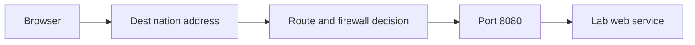

# Maintaining the handbook diagrams

Mermaid describes a diagram with text. A Markdown code block must be labelled `mermaid`; a `css` block is ordinary source code. GitHub renders Mermaid in Markdown automatically. The interactive guide uses reviewed SVG copies so diagrams also work offline and in PDFs, without loading an external script. [GitHub diagram documentation](https://docs.github.com/en/get-started/writing-on-github/working-with-advanced-formatting/creating-diagrams)

For example, this is the complete Markdown source:

````markdown

````

On the website, **View diagram source** expands the original notation. **Open full size** opens the vector illustration. Wide diagrams scroll inside their frame on small screens. Print preparation waits for illustrations to load, and the printed manual omits the source controls.

## Reading and checking

Readers do not need Mermaid, Node or Chromium installed. The public package includes `figures/mermaid/` and `app/diagram-index.json`.

From the public repository root, check that every Mermaid source matches its SVG and theme:

```sh
python3 tools/render_diagrams.py check
```

The Pages builder performs this check too. Editing a diagram, its heading, the renderer version or the theme requires regenerating the assets before publication. Updating only the release manifest does not bypass the diagram check.

## Regenerating after an edit

Maintainers need Node and the pinned official Mermaid CLI. Install build dependencies in a temporary directory **outside the public repository**, and keep that directory until rendering finishes:

```sh
diagram_tool_dir="$(mktemp -d /tmp/lab-mermaid-tool.XXXXXX)"
npm install --prefix "$diagram_tool_dir" --no-audit --no-fund --save-exact @mermaid-js/mermaid-cli@11.17.0
python3 tools/render_diagrams.py render --mmdc "$diagram_tool_dir/node_modules/.bin/mmdc"
python3 tools/render_diagrams.py check
```

The installation downloads dependencies and normally a compatible browser. This is a maintainer operation; the website never performs it. Rendering uses the monochrome theme in `tools/mermaid.config.json`, then checks that SVGs contain no embedded active elements or external resource references. [Official Mermaid CLI](https://github.com/mermaid-js/mermaid-cli)

An existing compatible browser can instead be configured with the CLI's Puppeteer JSON options. Pass a private configuration path with `--puppeteer-config /absolute/path/to/browser-options.json`; keep machine-specific executable paths outside the release. Confined browsers such as Snap Chromium may not see files in the ordinary `/tmp` directory. In that case, use a compatible browser installation or install the renderer in an accessible build directory outside the public repository.

Review the edited Markdown, all generated SVGs and the diagram index. Check the chapter in the local guide and **Print / PDF**. Then update the public manifest and commit the sources and assets together:

```sh
python3 tools/release.py manifest --reviewed-public-content
python3 tools/release.py check
```

Only hash-named SVGs in `figures/mermaid/` are replaced by the renderer. Original architecture illustrations elsewhere in `figures/` remain separate. No diagram command publishes to GitHub.
